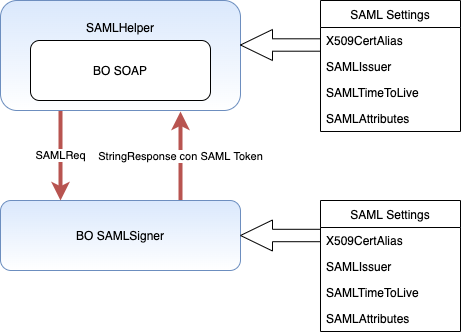

# SAML-COS

SAML2.0 Token for Catalan HealthCare Autorities from InterSystems IRIS ObjectScript.

# What is included?

SAML-COS includes *Business Operations* you can use in your productions to generate SAML tokens signed according to CatSalut requirements, without external dependencies.

# Requirements

A valid X509 Certificate is needed.

# Quick Start

Create your own test using a test docker environment. You can use [VSCode](https://code.visualstudio.com), see some [tutorials](https://comunidadintersystems.com/videotutoriales).

1. Clone the repository:
```
git clone https://github.com/intersystems-ib/SAML-COS
```

2. Build and run the sample environment. This will run an [InterSystems IRIS For Health](https://www.intersystems.com/products/intersystems-iris-for-health/) with *SAML-COS* installed
```bash
docker-compose build
docker-compose up
```

You can access now to the [Management Portal](http://localhost:52773/csp/sys/UtilHome.csp) using `superuser`/ `SYS`.

3. Go to [IBSP.CONN.SAML.Production.TestProduction](http://localhost:52773/csp/saml-cos/EnsPortal.ProductionConfig.zen?PRODUCTION=IBSP.CONN.SAML.Production.TestProduction) production and start the production.

4. There is a test WebApplication you can invoke doing a GET call to http://localhost:52773/saml-cos/api/test/:cip or doing a POST call to http://localhost:52773/saml-cos/api/test/ sending a request object including a "cip" property (e.g. {"cip":"ABCD0991231000"}). Both calls require authentication (superuser user can be used).  
It calls the "Test" Business Service and returns a dummy response.

5. Generate a valid Certificate as explained [here](#x509-certificate-upload-in-intersystems-iris) and load it in the Management Portal [X.509 Credentials](http://localhost:52773/csp/sys/sec/%25CSP.UI.Portal.X509Credentials.zen?$NAMESPACE=SAML-COS&$NAMESPACE=SAML-COS)

6. Create your Business Operation to call the CatSalut WebService, define the necessary [SAML parameters](#saml-configuration-parameters) and make it generate a SAML token. You have two different options to do so, as explained [here](#use-in-application).

7. Edit the "Test" Business Service and make it call your Business Operation.

8. Call the API REST and look at the production messages to see if the SAML token has been generated.

# Installation

## Using zpm

If you already have [ZPM Package Manager](https://github.com/intersystems-community/zpm), you can just move to your namespace (e.g. TEST) and type:

```
TEST> zpm
zpm:TEST> install saml-cos
```

## Alternative installation

* Go to [Releases](https://github.com/intersystems-ib/SAML-COS/releases) and download the latest version.
* Unzip it in a temporary directory (e.g. /tmp)
* Open an interactive session (terminal)
* Move to your namespace (e.g. TEST)

```objectscript
// move to your namespace
zn "TEST"
// load installer
do $system.OBJ.Load("/tmp/SAML-COS/src/IBSP/CONN/SAML/Installer.cls","ck")
// run installer
do ##class(ITB.Installer).Run("/tmp/SAML-COS")
```

# Components

| Type | Package | Class | Description |
| ---- | ------- | ----- | ----------- |
| X509 | | | X509 Certificate in PEM format loaded with public and private key |
| MSG | IBSP.CONN.SAML.Msg | SAMLReq | Request Message to obtain a SAML ticket |
| MSG | IBSP.CONN.SAML.Msg | SAMLRes | Response Message that SAMLcos Business Operation returns with the generated SAML token |
| Data | IBSP.CONN.SAML.Data | SAMLValues | Data specifying the characteristics of the SAML ticket |
| Host | `IBSP.CONN.SAML.BO` | SAMLHelper | Abstract class of Ens.Host that contains the utilities to call the SAML generation BO. Include as SuperClass in the BOs that need to generate SAML token |
| BO | `IBSP.CONN.SAML.BO` | SAMLSigner | The SAML Business Operation that generates the signature |
| BO | `IBSP.CONN.SAML.BO` | SAMLcos | SAML Business Operation that extends SAMLHelper and generates a SAML token |

# Implementation

Interaction scheme between the different production components for the generation of a SAML 2.0 token:

* The Interoperability Component that needs to generate a SAML ticket uses the "SAMLHelper" superclass. This class allows to define fixed values of SAML Attributes from the portal configuration parameters.
* To build a SAML token, the SAMLHelper sends a message "SAMLReq" to the Business Operation component "SAMLSigner".
* The "SAMLSigner" component can provide some default SAML attribute values, to indicate common default values.
* The "SAMLSigner" generates and signs the SAML Token with the X509 Certificate specified in X509CertAlias and returns in a StringResponse the signed token.
* The SOAP BO generates a Security SOAP Header and adds the signed SAML token there.



## SAML Configuration parameters

| Parameter | Example | Description |
| --------- | ------- | ----------- |
| X509CertAlias | HC3CERT | Alias name of the X509 certificate loaded in IRIS from the management portal. It is the certificate provided by CatSalut and used to sign the SAML ticket. |
| SAMLIssuer | HospitalXYZ | SAMLissuer name as specified by CatSalut. An arbitrary name works |
| SAMLTimeToLive | 600 | SAML token validity time in seconds. After this time (in case of message resending), the token will be rejected |
| SAMLAttributes | {"ResponsibleUser":"HCC0123AB","Profile":"MD","ProviderOrganization":"H0800000","Entity":"0123","CodeUp":"01234","GivenName":"SUPPORT","FirstFamilyName":"SUPPORT","DocumentType":"01","DocumentNumber":"12345678Z","Code":"108323233"} | SAML Attributes List. These attributes vary depending on the CatSalut Service to be invoked. The attributes are specified in JSON format from the portal. |

SAML configuration parameters can be defined in several places: some attribute values can be specific to each call (e.g. the identification of a physician signing a clinical document), others specific to a Web service, and others common to all calls (same X509 Certificate for all calls). To give more flexibility, SAML parameters and attributes can be defined in 3 places

| Place | Precedence | Description |
| ----- | ---------- | ----------- |
| SAMLReq Message | 1 | SAML Helper functions accept a SAMLValues object as input. This allows a SOAP BO to receive these values in the request and overwrite values defined as configuration parameters |
| BO SOAP Configuration Parameters through SAMLHelper | 2 | SAML parameters specific to the BO component. CaSalut provides some validations that it performs on the SAML attributes depending on the CatSalut service invoked |
| BO SAML SAMLSigner Configuration Parameters | 3 | Allows to define default values common to all calls using SAML token. For example, the value of X509CertAlias can be defined at this level. In the same way, if the Attributes "ProviderOrganization", "Entity", CodeUp are common for all calls, the SAMLAttributes parameter of the SAMLSigner can contain these properties/values in a JSON text |

## Required attributes depending on the Validation Type
| Validation | Required attributes |
| ---------- | ------------------- |
| Generic | "ResponsibleUser","Profile","Entity","ProviderOrganization" |
| ConsultaETC | "ResponsibleUser","Profile","Entity","ProviderOrganization","CodeUp","GivenName","FirstFamilyName","DocumentType","DocumentNumber","Code" |
| ServeisSocials | "ResponsibleUser","Profile","Entity","ProviderOrganization","AccessType" |
| NotificacioImatge	| "ResponsibleUser","Profile","Entity","ProviderOrganization","CodeUp" |
| Monitorizacio | "ResponsibleUser","Profile","Entity","ProviderOrganization" |
| Mau | "ResponsibleUser","Profile" |
| AccessLMS | "ResponsibleUser","Profile" |
| ConfirmacioRegistre | "ResponsibleUser","Profile","Entity","ProviderOrganization" |
| IHC3 | "ResponsibleUser","Profile","Entity","ProviderOrganization","CodeUp" |
| VisorProfesional | "ResponsibleUser","Profile","Entity","ProviderOrganization","CodeUp" |
| ConsultaDadesLMS | "ResponsibleUser","Profile","ProviderOrganization","GivenName","FirstFamilyName","DocumentNumber" |

The SAMLReq message to be sent to the signing BO allows to specify the value of a validation. This value allows the BO to fill in the minimum set of SAML attributes following the precedence guidelines (Message, SAMLHelper configuration, SAMLSigner configuration) before signing.

# Use in application

To use SAML20 classes in an application to call CatSalut services, it has to be proceeded as follows:

* Load an X509 Certificate in IRIS in PEM format, from the management portal. Look at section on Certificate conversions to PEM format. Give this certificate an Alias.
* Add the "SAMLcos" and "SAMLSigner" Business Operations to the production, leaving as component name the name of the class.
* If there is only one SAMLIssuer and one certificate defined, (most common case) associate this Certificate to the "SAMLSigner" BO, putting the name of the certificate Alias from the portal, and filling in the other configuration parameters and SAML attribute values that are common.
* Modify the Production component that has to generate a SAML ticket.

## Generate a SAML 2.0 token in a Business Operation

*  Add "IBSP.CONN.SAML.BO.SAMLHelper" class as supperclass in the Business Operation to add the SAML functionality.
*  Call "GetSAMLToken" method to generate the SAML token. This method has three parameters:
    * pValidator: The name of the validator to use. This determines which SAML Attributes are mandatory, and are copied to the list of SAML attributes to be signed.
    * pSAMLParams: Allows defining values of SAML Attributes that are specific to the message (name of the signing physician, etc). If the object is defined, its values overwrite the values reported by default as configuration parameters.
    * header: ByRef parameter. SOAP header object returned with the SAML token.

## Generate a SAML 2.0 token in a Business Service / Process (or even a Business Operation)

* Create a "SAMLReq" object with the necessary properties and call "SAMLcos" Business Operation.
* "SAMLcos" generates the token as explained above and returns it in the "data" property of the "SAMLRes" object.
* In a Business Operation, if preferred, instead of making the Business Operation extend "SAMLHelper", "SAMLcos" Business Operation can also be called to generate the token.

The SAML attribute values to define depend on the HC3 Web Service being called. Some Web Services require the ticket to include information about the actor (physical person) making the call, while other Web Services allow an anonymous call, or let the call be made with a generic user. The architecture of the implementation and the modifications to be made to the initial SOAP BO vary depending on whether the ticket can be anonymous (with fixed values), or with the actor identified (in which case this information has to reach IRIS from the external system via messaging).

If the Web Service needs the token to include actor data, the request objects sent to the Business Operation can be modified to inlcude a IBSP.CONN.SAML.Data.SAMLValues property to include this data.
```objectscript
Property SAMLData As IBSP.CONN.SAML.Data.SAMLValues;
```
And the this property can be sent as second parameter in the call to the "GetSAMLToken" method.

# X509 Certificate Upload in InterSystems IRIS

CatSalut usually delivers the certificates in pkcs12 format (with the extension .p12 or .pfx) with the private key protected by a password that has to be converted to pem format for uploading to IRIS. Extraction with openssl as well as uploading to IRIS requires access to the password protecting the certificate.

Commands to Transform a Certificate from PKCS12 to PEM

```
openssl pkcs12 -in cda.p12.pfx -out cda.key.pem -nocerts -nodes
openssl pkcs12 -in cda.p12.pfx -out -cda.crt.pem -clcerts -nokeys
```

Sometimes, the delivered .pfx file contains an internal RC2-40-CBC format that openssl cannot process; the solution is to import the certificate in the Windows CertStore and re-export it to change this internal format and have a .pfx processable by openssl

---
**NOTE**

*This application is an open-source add-on for InterSystems HealthCare products and does not form part of the official release. InterSystems WRC technical assistance will not attend issues related with this application.*

---